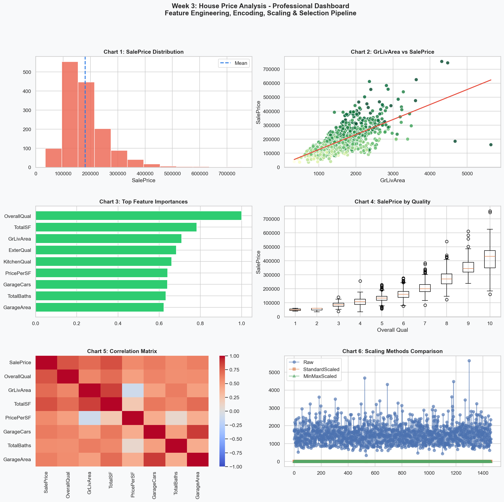

# AIML Internship Week 3: House Price Feature Engineering & Analysis

## Overview
This project demonstrates comprehensive feature engineering, exploratory data analysis (EDA), encoding, scaling, skewness transformation, and feature selection on the Kaggle House Prices dataset.

**Dataset:** Kaggle House Prices: Advanced Regression Techniques

## Dashboard Preview

## 5 Key Findings
1. **OverallQual** is the strongest single predictor of `SalePrice`.
2. **TotalSF** and **GrLivArea** provide strong size-based predictive signal.
3. Quality features like **ExterQual** and **KitchenQual** consistently rank near the top.
4. `SalePrice` is strongly right-skewed, and log transformation improves normality.
5. Removing low-variance and highly correlated features reduces dimensionality without losing important signal.

## Top 3 Engineered Features
1. **PricePerSF** - normalized house price by living area.
2. **TotalSF** - composite total square footage feature.
3. **QualCond** - interaction between quality and condition.

## Tools Used
- Python
- Pandas
- NumPy
- Matplotlib
- Seaborn
- SciPy
- Scikit-learn
- Jupyter Notebook

## Files Included
- `week3_visualization_dashboard.ipynb`
- `week3_dashboard.png`
- `week3_fe_pipeline.png`
- `train.csv`
- `test.csv`
- `data_description.txt`

## Notes
- The notebook contains all 18 steps executed with outputs visible.
- The repository is intended to be public for submission.
